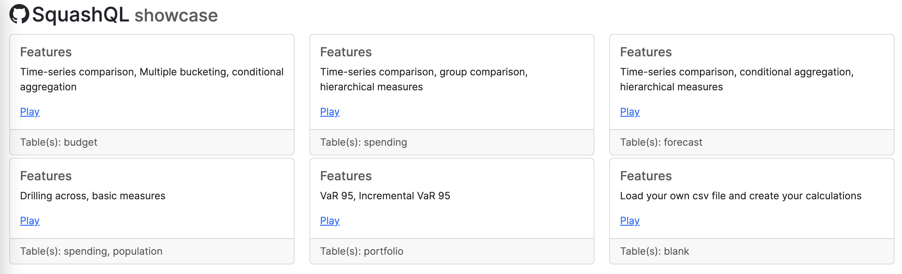

# Context

This project shows you how to set up a SquashQL server with DuckDB as database and how to use and build client applications
in Typescript with the [SquashQL TypeScript SQL-like query builder](https://www.npmjs.com/package/@squashql/squashql-js). 

It is recommended to start with the Typescript tutorial to get your hands dirty before using the 
single page application built in React.

## Project structure

The project contains three parts:

- A server (SpringBoot app) written in Java; under `src/`
- A typescript command line application; under `ts/`. Read [TUTORIAL.md](./TUTORIAL.md) to understand how to use it.
- A small Next.js web application; under `ui/` to demonstrate all the features SquashQL can offer and how to start 
building your own client application.

## Typescript tutorial

> **Note**
> The tutorial can be done with Codespaces. No need to install anything on your computer!

If you do not want to use Codespaces, you can installed and run the project locally or in a Docker container (see below). 

Read [TUTORIAL.md](./TUTORIAL.md) to try SquashQL with a hands-on training.

## Run locally without Docker

### Prerequisites

In order to build and run the server, you will need:
- [Java JDK](https://www.oracle.com/java/) >= 17
- Latest stable [Apache Maven](http://maven.apache.org/)
- Node.js >= 20

### Server

- Install prerequisites (see above)
- Launch the project
```bash
mvn spring-boot:run
```

Server address is: `http://localhost:8080`

## Run locally with Docker

### Prerequisites

- Install [Docker](https://docs.docker.com/engine/install/)

### Server 

The docker image is available on [dockerhub](https://hub.docker.com/r/paulbares/squashql-showcase). Run to download and start the container for the first time.

```
docker run -it -p 8080:8080 -p 9090:9090 -p 3000:3000 --name squashql-showcase paulbares/squashql-showcase:latest
```

Next time, simply run:
```
docker start -a paulbares/squashql-showcase
```

The image contains:
- A pre-configured SquashQL server started when launching the container
- An instance of [Visual Studio Code Server](https://code.visualstudio.com/docs/remote/vscode-server) to edit the code
  directly in the container
- The code source of this repository

Open this url: `http://localhost:8080` to start the pre-built webapp. If you want to change start the ui in dev mode, 
refer to _Start Next.js pivot table web app_ section below.  

Visual Studio is available at `http://localhost:9090`. Default password is `123456`.

You can start the [TUTORIAL.md](./TUTORIAL.md) from there.

## UI - Next.js application

The application show you how to build a web application to interactively generate different pivot tables. You can either 
run it locally on your computer if you have installed all prerequisites or use the built-in docker image containing everything 
needed. 

Here's what the application looks like


### Load tables from Google Sheets

The server is configured to be able to load Google Sheets into the embedded DuckDB instance. Check the file `ts/duckdb.ts`. 
It can be run from the root directory with

```
npm --prefix ts run duckdb
```

It will load three tables (population, spending and portfolio) from three different public Sheets identified by their gid and id.

### Start Next.js pivot table web app

To start Next.js in development mode.

```
npm --prefix ui run dev
```

Open `http://localhost:3000` in your browser. You will see 6 cards. Each one of them will show you one or several SquashQL 
feature. Do not hesitate to try them all! Here's the full list of features and below some examples: conditional aggregation, 
basic aggregation, time-series comparison, multiple dynamic bucketing, group comparison, hierarchical measures, drilling across.



The drilling across feature, querying two fact tables at the same time


The percentage of parent a.k.a. [hierarchical comparison](https://github.com/squashql/squashql/blob/main/documentation/QUERY.md#hierarchical--parent-child-comparison).
The parenthood is **automatically** determined by the columns set on the rows. 


