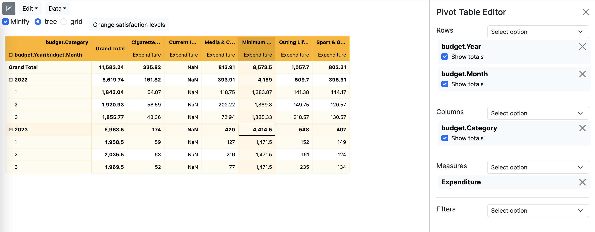

This tutorial is based on a simulated [personal budget spreadsheet](src/main/resources/personal_budget.csv) to help analyzing our
hypothetical finances. It contains data only for the first 3 months of 2022 and 2023 to work with a small dataset. If you open it, 
you'll see a column "Scenarios" to illustrate the What-If simulation concept. The "Scenarios" column in the csv file is used to create
the final dataset by exploding the initial dataset where each item in the list is placed into its own row. More details in section 3. 

This is what the final dataset looks like:

```
+--------------------+--------------------+-------------+----+-----+---+----------+--------------------+------+---------------+--------+
|Income / Expenditure|            Category|  Subcategory|Year|Month|Day|      Date|         Description|Amount|Happiness score|Scenario|
+--------------------+--------------------+-------------+----+-----+---+----------+--------------------+------+---------------+--------+
|         Expenditure|Cigarettes & Alcohol|Miscellaneous|2022|    1|  1|01/01/2022|          Cigarettes|   9.3|              2|       b|
|         Expenditure|Cigarettes & Alcohol|Miscellaneous|2022|    1|  1|01/01/2022|          Cigarettes|   9.3|              2|      ss|
|         Expenditure|Cigarettes & Alcohol|Miscellaneous|2022|    1|  1|01/01/2022|          Cigarettes|   9.3|              2|      sm|
|         Expenditure|Cigarettes & Alcohol|Miscellaneous|2022|    1|  1|01/01/2022|          Cigarettes|   9.3|              2|      so|
|              Income|      Current Income|       Salary|2022|    1|  1|01/01/2022|              Salary|1930.0|           null|       b|
|              Income|      Current Income|       Salary|2022|    1|  1|01/01/2022|              Salary|1930.0|           null|      ss|
|              Income|      Current Income|       Salary|2022|    1|  1|01/01/2022|              Salary|1930.0|           null|      sc|
|              Income|      Current Income|       Salary|2022|    1|  1|01/01/2022|              Salary|1930.0|           null|      sm|
|              Income|      Current Income|       Salary|2022|    1|  1|01/01/2022|              Salary|1930.0|           null|      so|
|              Income|      Current Income|       Salary|2022|    1|  1|01/01/2022|              Salary|1930.0|           null|     sco|
|              Income|      Current Income|       Salary|2022|    1|  1|01/01/2022|              Salary|1930.0|           null|     smc|
|              Income|      Current Income|       Salary|2022|    1|  1|01/01/2022|              Salary|1930.0|           null|    smco|
|         Expenditure| Minimum expenditure|      Housing|2022|    1|  1|01/01/2022|House rent (with ...|691.16|           null|       b|
|         Expenditure| Minimum expenditure|      Housing|2022|    1|  1|01/01/2022|House rent (with ...|691.16|           null|      ss|
|         Expenditure| Minimum expenditure|      Housing|2022|    1|  1|01/01/2022|House rent (with ...|691.16|           null|      sc|
|         Expenditure| Minimum expenditure|      Housing|2022|    1|  1|01/01/2022|House rent (with ...|691.16|           null|      sm|
|         Expenditure| Minimum expenditure|      Housing|2022|    1|  1|01/01/2022|House rent (with ...|691.16|           null|      so|
|         Expenditure| Minimum expenditure|      Housing|2022|    1|  1|01/01/2022|House rent (with ...|691.16|           null|     sco|
|         Expenditure| Minimum expenditure|      Housing|2022|    1|  1|01/01/2022|House rent (with ...|691.16|           null|     smc|
|         Expenditure| Minimum expenditure|      Housing|2022|    1|  1|01/01/2022|House rent (with ...|691.16|           null|    smco|
+--------------------+--------------------+-------------+----+-----+---+----------+--------------------+------+---------------+--------+
```

You'll have to write some code using the [Typescript library](https://www.npmjs.com/package/@squashql/squashql-js).
Write the code in the file index.ts (Full path = `ts/src/index.ts`). You'll be asked to execute queries. Here's code snippet
showing you how to execute a query and print the result in the console once the server is up. 

The name of the table is **budget**. The file `tables.ts` contains a class `Budget` with [type definitions](https://github.com/squashql/squashql-codegen) that represents
tables and fields of the budget table.

```typescript
import {from, Querier,} from "@squashql/squashql-js"
import {budget} from "./tables"

const querier = new Querier("http://localhost:8080")
const query = from(budget._name)// TODO continue to edit the query

querier.executeQuery(query, undefined, true)
        .then(r => console.log(r));
```

Please refer as mush as possible to the [Typescript library documentation](https://github.com/squashql/squashql/blob/main/documentation/QUERY.md).

## Set up the project

### Locally

You can either start the server locally if you have setup a development environment. See the README.md at the root of this project to install 
all the prerequisites. 

### Codespaces

Alternatively you can use Codespaces, a service provided by GitHub to setup a development environment hosted in the cloud, it's free you only need a GitHub account.
Click on [this link](https://github.com/codespaces/new?machine=basicLinux32gb&repo=580807210&ref=main&location=WestEurope&devcontainer_path=.devcontainer%2Fdevcontainer.json) to start
using Codespaces. Then click on *Create codespace*. It will take a few minutes to set everything up.

In the terminal:
```bash
mvn spring-boot:run
```
It will download all dependencies and launch the server. If everything works as expected, you should see this in the console output
```
2023-02-28 10:44:01.807  INFO 2678 --- [main] o.s.b.w.embedded.tomcat.TomcatWebServer  : Tomcat started on port(s): 8080 (http) with context path ''
2023-02-28 10:44:01.822  INFO 2678 --- [main] io.squashql.ShowcaseApplication          : Started ShowcaseApplication in 10.332 seconds (JVM running for 11.514)
```

Open the file `ts/src/index.ts` and start editing it by following the instructions below. To run the file index.ts, open a new terminal 
and execute
```bash
npm --prefix ts/ start
```

Note: Once you finish the tutorial, don't forget to [stop your Codespace](https://docs.github.com/en/codespaces/developing-in-codespaces/deleting-a-codespace).

## Basic queries and calculations  
Create a measure that computes the income.

<details><summary>Hint</summary>

Use the `sumIf` aggregation function with a criterion on Income / Expenditure column.
</details>
<details><summary>Code</summary>

```typescript
const income = sumIf("Income", budget.amount, criterion(budget.incomeExpenditure, eq("Income")))
```
</details>

Create a measure that computes the expenditure.

<details><summary>Hint</summary>

Use the `sumIf` aggregation function with a criterion on Income / Expenditure column.
</details>
<details><summary>Code</summary>

```typescript
const expenditure = sumIf("Expenditure", budget.amount, criterion(budget.incomeExpenditure, neq("Income")))
```
</details>

Create and execute a query that shows by year, month and category with a filter on the scenario named "b" the income and expenditure
values side by side.

<details><summary>Hint</summary>

Filter the table with `criterion(budget.scenario, eq("b"))`
</details>

<details><summary>Code</summary>

```typescript
const query = from(budget._name)
        .where(criterion(budget.scenario, eq("b")))
        .select([budget.year, budget.month, budget.category], [], [income, expenditure])
        .build()
```
</details>
<details><summary>Result</summary>

```
+------+-------+---------------------------------+--------+--------------------+
| Year | Month |                        Category | Income |        Expenditure |
+------+-------+---------------------------------+--------+--------------------+
| 2022 |     1 |            Cigarettes & Alcohol |   null | 54.870000000000005 |
| 2022 |     1 |                  Current Income | 1930.0 |               null |
| 2022 |     1 | Media & Clothes & Food Delivery |   null |             118.75 |
| 2022 |     1 |             Minimum expenditure |   null |            1383.87 |
| 2022 |     1 |                Outing Lifestyle |   null |             141.38 |
| 2022 |     1 |             Sport & Game & misc |   null | 124.17000000000002 |
| 2022 |     2 |            Cigarettes & Alcohol |   null |              58.59 |
| 2022 |     2 |                  Current Income | 1930.0 |               null |
| 2022 |     2 | Media & Clothes & Food Delivery |   null | 202.22000000000003 |
| 2022 |     2 |             Minimum expenditure |   null | 1389.7999999999997 |
| 2022 |     2 |                Outing Lifestyle |   null |             149.75 |
| 2022 |     2 |             Sport & Game & misc |   null |             120.57 |
| 2022 |     3 |            Cigarettes & Alcohol |   null |              48.36 |
| 2022 |     3 |                  Current Income | 1930.0 |               null |
| 2022 |     3 | Media & Clothes & Food Delivery |   null |              72.94 |
| 2022 |     3 |             Minimum expenditure |   null |            1385.33 |
| 2022 |     3 |                Outing Lifestyle |   null | 218.57000000000005 |
| 2022 |     3 |             Sport & Game & misc |   null |             130.57 |
| 2023 |     1 |            Cigarettes & Alcohol |   null |               59.0 |
| 2023 |     1 |                  Current Income | 2010.0 |               null |
| 2023 |     1 | Media & Clothes & Food Delivery |   null |              127.0 |
| 2023 |     1 |             Minimum expenditure |   null |             1471.5 |
| 2023 |     1 |                Outing Lifestyle |   null |              152.0 |
| 2023 |     1 |             Sport & Game & misc |   null |              129.0 |
| 2023 |     2 |            Cigarettes & Alcohol |   null |               63.0 |
| 2023 |     2 |                  Current Income | 2010.0 |               null |
| 2023 |     2 | Media & Clothes & Food Delivery |   null |              216.0 |
| 2023 |     2 |             Minimum expenditure |   null |             1471.5 |
| 2023 |     2 |                Outing Lifestyle |   null |              161.0 |
| 2023 |     2 |             Sport & Game & misc |   null |              124.0 |
| 2023 |     3 |            Cigarettes & Alcohol |   null |               52.0 |
| 2023 |     3 |                  Current Income | 2010.0 |               null |
| 2023 |     3 | Media & Clothes & Food Delivery |   null |               77.0 |
| 2023 |     3 |             Minimum expenditure |   null |             1471.5 |
| 2023 |     3 |                Outing Lifestyle |   null |              235.0 |
| 2023 |     3 |             Sport & Game & misc |   null |              134.0 |
+------+-------+---------------------------------+--------+--------------------+
```
</details>

Create a measure that computes the net income i.e. the difference between income and expenditure and then execute a query 
to show the net income for each month of the year. Keeps on filtering on the scenario named "b".

<details><summary>Hint</summary>

Use the `minus` operator to compute the difference.

</details>
<details><summary>Code</summary>

```typescript
const netIncome = minus("Net income", income, expenditure)
const query = from(budget._name)
        .where(criterion(budget.scenario, eq("b")))
        .select([budget.year, budget.month], [], [netIncome])
        .build()
```
</details>
<details><summary>Result</summary>

```
+------+-------+--------------------+
| Year | Month |         Net income |
+------+-------+--------------------+
| 2022 |     1 | 106.96000000000026 |
| 2022 |     2 |  9.070000000000391 |
| 2022 |     3 |  74.23000000000047 |
| 2023 |     1 |               71.5 |
| 2023 |     2 |              -25.5 |
| 2023 |     3 |               40.5 |
+------+-------+--------------------+
```
</details>

Try to `rollup` on "Year", "Month" to add totals and subtotals to the result. Rollup on Month only to remove the Grand Total.  
<details><summary>Code</summary>

```typescript
const query = from(budget._name)
        .where(criterion(budget.scenario, eq("b")))
        .select([budget.year, budget.month], [], [netIncome])
        .rollup([budget.year, budget.month])
        .build()
```
</details>
<details><summary>Result</summary>

```
+-------------+-------------+--------------------+
|        Year |       Month |         Net income |
+-------------+-------------+--------------------+
| Grand Total | Grand Total | 276.75999999999476 |
|        2022 |       Total | 190.25999999999476 |
|        2022 |           1 | 106.96000000000026 |
|        2022 |           2 |  9.070000000000391 |
|        2022 |           3 |  74.23000000000047 |
|        2023 |       Total |               86.5 |
|        2023 |           1 |               71.5 |
|        2023 |           2 |              -25.5 |
|        2023 |           3 |               40.5 |
+-------------+-------------+--------------------+
```
</details>

## Time-series comparison

Create a measure that computes the Net Income growth. The calculation is a given year's net income minus the prior year's net income, divided by the prior year's net income.
A comparison can use different type of comparison method. In our case, we can use `ComparisonMethod.RELATIVE_DIFFERENCE`.

<details><summary>Hint</summary>

Use the `comparisonMeasureWithPeriod` to create the comparison measure.
</details>
<details><summary>Code</summary>

```typescript
const netIncomeGrowth = comparisonMeasureWithPeriod(
        "YoY Net Income Growth",
        ComparisonMethod.RELATIVE_DIFFERENCE,
        netIncome,
        new Map([[budget.year, "y-1"]]),
        new Year(budget.year))
```
</details>

Execute a query that shows the Net Income Growth for each year.

<details><summary>Result</summary>

```typescript      
const query = from(budget._name)
        .where(criterion(budget.scenario, eq("b")))
        .select([budget.year], [], [netIncome, netIncomeGrowth])
        .build()
```

```
+------+--------------------+--------------------------------+
| Year |         Net Income | Net Income growth (prev. year) |
+------+--------------------+--------------------------------+
| 2022 | 190.25999999999476 |                           null |
| 2023 |               86.5 |            -0.5453589824450626 |
+------+--------------------+--------------------------------+
```
This result shows us we have spent more money in 2023 than in 2022.
</details>

## Dynamic bucketing

Dynamic bucketing refers to a technique used to group or categorize values into discrete bins or buckets based 
on the characteristics of the values themselves, rather than predefined static bin boundaries. This approach is particularly
useful when dealing with numerical or continuous data that may have a wide range of values and varied distributions.

Once you determine the boundaries of your buckets, you then apply these dynamically computed bins to the data, assigning 
each value to the appropriate bucket. This can be done with SquashQL by using a [virtual table](https://github.com/squashql/squashql/blob/main/documentation/QUERY.md#joining-on-virtual-created-on-the-fly-at-query-time)
that can be joined to another table, the one containing your data. The fields of this virtual table can then be used are 
regular fields in the query on which group by clause can be applied. 

Let's illustrate this concept with a simple example. The *happiness score* is a rating of 1 through 5 that we arbitrary 
set to assess how much an expenditure affect (in a positive way) our well-being. Try to execute the following query

```typescript
import {countRows} from "@squashql/squashql-js";

const expenditure = sumIf("Expenditure", budget.amount, criterion(budget.incomeExpenditure, neq("Income")))
const query = from(budget._name)
        .where(
                all([
                  criterion(budget.scenario, eq("b")),
                  criterion(budget.year, eq(2023)),
                ]))
        .select([budget.year, budget.happinessScore], [], [expenditure])
        .build()
```

<details><summary>Result</summary>

```
+-------------+------------------------+-------------+
| budget.Year | budget.Happiness score | Expenditure |
+-------------+------------------------+-------------+
|        2023 |                      0 |      4674.5 |
|        2023 |                      0 |         NaN |
|        2023 |                      1 |       208.0 |
|        2023 |                      2 |       461.0 |
|        2023 |                      3 |       126.0 |
|        2023 |                      4 |        null |
+-------------+------------------------+-------------+
```
This result shows for the year 2023 the distribution of the expenses. Notice how filters have been combined by using `all`.  
</details>

Instead of using Happiness score, we can classify each expense into buckets that define satisfaction levels as follows:

| satisfaction level | lower bound | upper bound |
|--------------------|-------------|-------------|
| neutral            | 0           | 2           |
| happy              | 2           | 4           |
| very happy         | 4           | 5           |

And use this column, satisfaction level, for our analysis. 

Let's first define the virtual table in Typescript:
```typescript
import {TableField, VirtualTable} from "@squashql/squashql-js"

class SatisfactionLevels {
  readonly _name: string = "satisfaction_level"
  readonly satisfactionLevel: TableField = new TableField("satisfaction_level.satisfaction_level")
  readonly lowerBound: TableField = new TableField("satisfaction_level.lower_bound")
  readonly upperBound: TableField = new TableField("satisfaction_level.upper_bound")
}

const satisfactionLevels = new SatisfactionLevels()

const records = [
  ["neutral", 0, 2],
  ["happy", 2, 4],
  ["very happy", 4, 5],
]
const satisfactionLevelsVT = new VirtualTable(
        satisfactionLevels._name,
        [
          satisfactionLevels.satisfactionLevel.fieldName,
          satisfactionLevels.lowerBound.fieldName,
          satisfactionLevels.upperBound.fieldName
        ], records)
```

that can be joined to the table with a criteria (non-equi join) to associate a bucket to a given row based on the Happiness
score value. The table is not materialized anywhere and exists only during the execution time of the query. Due to the 
condition types used here, the lower bound is inclusive and the upper bound is exclusive.

```typescript
import {countRows} from "@squashql/squashql-js"

const query = from(budget._name)
        .joinVirtual(satisfactionLevelsVT, JoinType.INNER)
        .on(all([
          criterion_(budget.happinessScore, satisfactionLevels.lowerBound, ConditionType.GE),
          criterion_(budget.happinessScore, satisfactionLevels.upperBound, ConditionType.LT)
        ]))
        .where(
                all([
                  criterion(budget.scenario, eq("b")),
                  criterion(budget.year, eq(2023)),
                ]))
        .select([satisfactionLevels.satisfactionLevel], [], [expenditure, countRows])
        .build()
```

<details><summary>Result</summary>

```
+---------------------------------------+-------------+----------------------+
| satisfaction_level.satisfaction_level | Expenditure | _contributors_count_ |
+---------------------------------------+-------------+----------------------+
|                                 happy |       587.0 |                   31 |
|                               neutral |      4882.5 |                   74 |
|                            very happy |       494.0 |                   16 |
+---------------------------------------+-------------+----------------------+
```
</details>

We use `countRows` in the query to know the number of expenses that fall into a given bucket.

Try to change the boundaries or add new levels.

Now that we know the distribution of the expenses per satisfaction levels, we would like to know if we can save money by, 
for instance, cutting expenses with a high cost and for which the satisfaction level is neutral. To do that, we can apply 
a new bucketing on top of the one described above. 

Let's define a new virtual table to classify expenses according to their cost. Expenses with amount between `[0, 10[` will 
be classified as low, between `[10, 40[` as medium and between `[40, 500[` as high.
```typescript
class ExpenseLevels {
  readonly _name: string = "expense_level"
  readonly expenseLevel: TableField = new TableField("expense_level.expense_level")
  readonly lowerBound: TableField = new TableField("expense_level.lower_bound")
  readonly upperBound: TableField = new TableField("expense_level.upper_bound")
}

const expenseLevels = new ExpenseLevels()

const expenseLevelsRecords = [
  ["low", 0, 10],
  ["medium", 10, 40],
  ["high", 40, 500],
]
const expenseLevelsVT = new VirtualTable(
        expenseLevels._name,
        [
          expenseLevels.expenseLevel.fieldName,
          expenseLevels.lowerBound.fieldName,
          expenseLevels.upperBound.fieldName
        ], expenseLevelsRecords)
```

To use is, we simply join again on this table:
```typescript
const query = from(budget._name)
        .joinVirtual(satisfactionLevelsVT, JoinType.INNER)
        .on(all([
          criterion_(budget.happinessScore, satisfactionLevels.lowerBound, ConditionType.GE),
          criterion_(budget.happinessScore, satisfactionLevels.upperBound, ConditionType.LT)
        ]))
        .joinVirtual(expenseLevelsVT, JoinType.INNER)
        .on(all([
          criterion_(budget.amount, expenseLevels.lowerBound, ConditionType.GE),
          criterion_(budget.amount, expenseLevels.upperBound, ConditionType.LT)
        ]))
        .where(
                all([
                  criterion(budget.scenario, eq("b")),
                  criterion(budget.year, eq(2023)),
                ]))
        .select([satisfactionLevels.satisfactionLevel, expenseLevels.expenseLevel], [], [countRows])
        .orderByFirstElements(expenseLevels.expenseLevel, ["low", "medium", "high"])
        .orderByFirstElements(satisfactionLevels.satisfactionLevel, ["neutral", "happy", "very happy"])
        .build()
```

<details><summary>Result</summary>

```
+---------------------------------------+-----------------------------+----------------------+
| satisfaction_level.satisfaction_level | expense_level.expense_level | _contributors_count_ |
+---------------------------------------+-----------------------------+----------------------+
|                               neutral |                         low |                    3 |
|                               neutral |                      medium |                   28 |
|                               neutral |                        high |                   40 |
|                                 happy |                         low |                    3 |
|                                 happy |                      medium |                   22 |
|                                 happy |                        high |                    6 |
|                            very happy |                      medium |                   14 |
|                            very happy |                        high |                    2 |
+---------------------------------------+-----------------------------+----------------------+
```

</details>

We notice 40 expenses have a high cost for a neutral level of satisfaction. You can try to dig into the data by using the 
previous query, filtering on `satisfaction_level = neutral` and `expense_level = low` to see if any of them can be cut and
displaying the category, sub-category and other attributes.

## What-if comparison

To illustrate the concept of What-If simulations, the column named "Scenarios" contains for each 
row a list of scenario codes.
The Base scenario (code `b`) represents the current situation from which scenarios are derived. For instance,
the scenario with code `ss` means we stop all activities related to the category **Sport & Game & misc**.

| Code | Full name / Category                                                           |
|------|--------------------------------------------------------------------------------|
| b    | Base                                                                           |
| ss   | Stop Sport & Game & misc                                                       |
| sc   | Stop Cigarettes & Alcohol                                                      |
| sm   | Stop Media & Clothes & Food Delivery                                           |
| so   | Stop Outing Lifestyle                                                          |
| sco  | Stop Outing Lifestyle & Cigarettes & Alcohol                                   |
| smc  | Stop Media & Clothes & Food Delivery & Cigarettes & Alcohol                    |
| smco | Stop Media & Clothes & Food Delivery & Cigarettes & Alcohol & Outing Lifestyle |

Execute the following query: 
```typescript
const query = from(budget._name)
        .select([budget.scenario, budget.year], [], [netIncome])
        .build()
```

It shows the Net Income for each scenario and for each year. Apply a filter on 2023 to focus on the current year. We can
remove "Year" from the query. You should have something like this:

<details><summary>Code</summary>

```typescript
const query = from(budget._name)
        .where(criterion(budget.year, eq(2023)))
        .select([budget.scenario], [], [netIncome])
        .build()
```
</details>

<details><summary>Result</summary>

```
+-----------------+------------+
| budget.Scenario | Net income |
+-----------------+------------+
|               b |       66.5 |
|              sc |      240.5 |
|             sco |      788.5 |
|              sm |      486.5 |
|             smc |      660.5 |
|            smco |     1208.5 |
|              so |      614.5 |
|              ss |      473.5 |
+-----------------+------------+
```
</details>

Let's create groups of scenarios. Each group determines which scenarios will be compared to. 

```typescript
const groups = new Map(Object.entries({
  "group1": ["b", "sc", "sco"],
  "group2": ["b", "sm", "smc", "smco"],
  "group3": ["b", "so", "sco", "smco"],
  "group4": ["b", "ss"],
}))
```

The groups are simply map. The keys are group name and values are the list of scenario names. A scenario 
can be in multiple groups. We use this map to create a [ColumnSet](https://github.com/squashql/squashql/blob/main/documentation/QUERY.md#group-comparison---columnset).

```typescript
import {budget} from "./tables";

const columnSet = new GroupColumnSet(new TableField("group"), budget.scenario, groups)
```

Execute the following query containing the previously defined column set. Notice you do not need to add the Scenario column
to the query, it is added automatically by using `columnSet`. Adding it to the query will make a new column and new rows appear

<details open><summary>Code</summary>

```typescript
import {budget} from "./tables";

const query = from(budget._name)
    .where(criterion(budget.year, eq(2023)))
    .select([], [columnSet], [netIncome])
    .build()
```

</details>
<details><summary>Result</summary>

```
+--------+-----------------+------------+
|  group | budget.Scenario | Net income |
+--------+-----------------+------------+
| group1 |               b |       66.5 |
| group1 |              sc |      240.5 |
| group1 |             sco |      788.5 |
| group2 |               b |       66.5 |
| group2 |              sm |      486.5 |
| group2 |             smc |      660.5 |
| group2 |            smco |     1208.5 |
| group3 |               b |       66.5 |
| group3 |              so |      614.5 |
| group3 |             sco |      788.5 |
| group3 |            smco |     1208.5 |
| group4 |               b |       66.5 |
| group4 |              ss |      473.5 |
+--------+-----------------+------------+
```
</details>

Among a given group, we need to compare the value of Net Income with the value of the previous scenario.
There's a built-in measure to perform such calculation and the definition of "previous scenario" is similar to the one 
used to express "previous year" we saw earlier.

<details><summary>Hint</summary>

Use the `comparisonMeasureWithinGroup` to create the comparison measure.
</details>
<details><summary>Code</summary>

```typescript
const netIncomeCompPrev = comparisonMeasureWithinSameGroup(
        "Net Income comp. with prev. scenario",
        ComparisonMethod.ABSOLUTE_DIFFERENCE,
        netIncome,
        new Map([[budget.scenario, "s-1"]]))
```
</details>

Add to the previous query this new measure.

<details><summary>Result</summary>

```typescript      
const query = from(budget._name)
        .where(criterion(budget.year, eq(2023)))
        .select([], [columnSet], [netIncome, netIncomeCompPrev])
        .build()
```

```
+--------+-----------------+------------+--------------------------------------+
|  group | budget.Scenario | Net income | Net Income comp. with prev. scenario |
+--------+-----------------+------------+--------------------------------------+
| group1 |               b |       66.5 |                                  0.0 |
| group1 |              sc |      240.5 |                                174.0 |
| group1 |             sco |      788.5 |                                548.0 |
| group2 |               b |       66.5 |                                  0.0 |
| group2 |              sm |      486.5 |                                420.0 |
| group2 |             smc |      660.5 |                                174.0 |
| group2 |            smco |     1208.5 |                                548.0 |
| group3 |               b |       66.5 |                                  0.0 |
| group3 |              so |      614.5 |                                548.0 |
| group3 |             sco |      788.5 |                                174.0 |
| group3 |            smco |     1208.5 |                                420.0 |
| group4 |               b |       66.5 |                                  0.0 |
| group4 |              ss |      473.5 |                                407.0 |
+--------+-----------------+------------+--------------------------------------+
```
</details>

To save the most money, the scenario *smco* is unsurprisingly (because we cut a lot of costs) the most interesting. 
However, the saved amount is not be the only criteria to decide which scenario is the best: we have to use the *happiness score*
(see the data) to help us decide. The *happiness score* is a rating of 1 through 5 that we arbitrary set to assess how much 
an expenditure affect (in a positive way) our well-being. 

Create a measure that aggregates Happiness score values with the sum function and use it to create a comparison measure 
in the same way *Net Income comp. with prev. scenario* has been done.

<details><summary>Code</summary>

```typescript
const happiness = sum("Happiness score sum", budget.happinessScore);
const happinessCompPrev = comparisonMeasureWithinSameGroup(
        "Happiness score sum comp. with prev. scenario",
        ComparisonMethod.ABSOLUTE_DIFFERENCE,
        happiness,
        new Map([[budget.scenario, "s-1"]]))
```
</details>

Add them to the previous query.

<details><summary>Result</summary>

```typescript      
const query = from(budget._name)
        .where(criterion(budget.year, eq(2023)))
        .select([budget.year], [columnSet], [netIncome, happiness,  netIncomeCompPrev, happinessCompPrev])
        .build()
```

```
+--------+-----------------+------------+--------------------------------------+-----------------------------------------------+
|  group | budget.Scenario | Net income | Net Income comp. with prev. scenario | Happiness score sum comp. with prev. scenario |
+--------+-----------------+------------+--------------------------------------+-----------------------------------------------+
| group1 |               b |       66.5 |                                  0.0 |                                             0 |
| group1 |              sc |      240.5 |                                174.0 |                                           -33 |
| group1 |             sco |      788.5 |                                548.0 |                                           -28 |
| group2 |               b |       66.5 |                                  0.0 |                                             0 |
| group2 |              sm |      486.5 |                                420.0 |                                           -62 |
| group2 |             smc |      660.5 |                                174.0 |                                           -33 |
| group2 |            smco |     1208.5 |                                548.0 |                                           -28 |
| group3 |               b |       66.5 |                                  0.0 |                                             0 |
| group3 |              so |      614.5 |                                548.0 |                                           -28 |
| group3 |             sco |      788.5 |                                174.0 |                                           -33 |
| group3 |            smco |     1208.5 |                                420.0 |                                           -62 |
| group4 |               b |       66.5 |                                  0.0 |                                             0 |
| group4 |              ss |      473.5 |                                407.0 |                                           -21 |
+--------+-----------------+------------+--------------------------------------+-----------------------------------------------+
```
</details>

Create two new comparison measures to compare Net Income and Happiness score values to the first scenario
of each group instead of the previous scenario.

<details><summary>Hint</summary>

Use the `first` keyword in `{["Scenario"]: "s-1"}` to change the reference position with which a value is compared to. 
</details>
<details><summary>Code</summary>

```typescript
const netIncomeCompFirst = comparisonMeasureWithinSameGroup(
        "Net Income comp. with first scenario",
        ComparisonMethod.ABSOLUTE_DIFFERENCE,
        netIncome,
        new Map([[budget.scenario, "first"]]))
const happinessCompFirst = comparisonMeasureWithinSameGroup(
        "Happiness score sum comp. with first scenario",
        ComparisonMethod.ABSOLUTE_DIFFERENCE,
        happiness,
        new Map([[budget.scenario, "first"]]))
```
</details>

Add them to the previous query.

<details><summary>Result</summary>

```typescript      
const query = from(budget._name)
        .where(criterion(budget.year, eq(2023)))
        .select([budget.year], [columnSet], [netIncome, happiness, netIncomeCompPrev, netIncomeCompFirst, happinessCompPrev, happinessCompFirst])
        .build()
```

```
+--------+-----------------+-------------+------------+---------------------+--------------------------------------+--------------------------------------+-----------------------------------------------+-----------------------------------------------+
|  group | budget.Scenario | budget.Year | Net income | Happiness score sum | Net Income comp. with prev. scenario | Net Income comp. with first scenario | Happiness score sum comp. with prev. scenario | Happiness score sum comp. with first scenario |
+--------+-----------------+-------------+------------+---------------------+--------------------------------------+--------------------------------------+-----------------------------------------------+-----------------------------------------------+
| group1 |               b |        2023 |       66.5 |                 144 |                                  0.0 |                                  0.0 |                                             0 |                                             0 |
| group1 |              sc |        2023 |      240.5 |                 111 |                                174.0 |                                174.0 |                                           -33 |                                           -33 |
| group1 |             sco |        2023 |      788.5 |                  83 |                                548.0 |                                722.0 |                                           -28 |                                           -61 |
| group2 |               b |        2023 |       66.5 |                 144 |                                  0.0 |                                  0.0 |                                             0 |                                             0 |
| group2 |              sm |        2023 |      486.5 |                  82 |                                420.0 |                                420.0 |                                           -62 |                                           -62 |
| group2 |             smc |        2023 |      660.5 |                  49 |                                174.0 |                                594.0 |                                           -33 |                                           -95 |
| group2 |            smco |        2023 |     1208.5 |                  21 |                                548.0 |                               1142.0 |                                           -28 |                                          -123 |
| group3 |               b |        2023 |       66.5 |                 144 |                                  0.0 |                                  0.0 |                                             0 |                                             0 |
| group3 |              so |        2023 |      614.5 |                 116 |                                548.0 |                                548.0 |                                           -28 |                                           -28 |
| group3 |             sco |        2023 |      788.5 |                  83 |                                174.0 |                                722.0 |                                           -33 |                                           -61 |
| group3 |            smco |        2023 |     1208.5 |                  21 |                                420.0 |                               1142.0 |                                           -62 |                                          -123 |
| group4 |               b |        2023 |       66.5 |                 144 |                                  0.0 |                                  0.0 |                                             0 |                                             0 |
| group4 |              ss |        2023 |      473.5 |                 123 |                                407.0 |                                407.0 |                                           -21 |                                           -21 |
+--------+-----------------+-------------+------------+---------------------+--------------------------------------+--------------------------------------+-----------------------------------------------+-----------------------------------------------+
```
</details>

Notice how stopping Media & Clothes & Food Delivery affects the happiness score: -62 for a saving of 420. Is it worth it?

## Pivot Table

[The documentation is available here](https://github.com/squashql/squashql#pivot-table-query)

A pivot table is a powerful tool to calculate, summarize, and analyze data that lets you see comparisons, patterns, and trends in your data.  
SquashQL has the capability of providing the necessary information to build pivot table. Let's go back to the first query:

```typescript
const query = from(budget._name)
        .where(criterion(budget.scenario, eq("b")))
        .select([budget.year, budget.month, budget.category], [], [expenditure])
        .build()
```

The displayed table is hard to analyze. By using the pivot table feature of SquashQL, we can change the layout of the result 
and display Year and Month on rows and Category on columns:

```typescript
const pivotConfig = {rows: [budget.year, budget.month], columns: [budget.category]};
querier.executePivotQuery(query, pivotConfig, true).then(r => console.log(r));
```

Note: if you use VSCode, line in Terminal are wrapped leading to printing an unreadable pivot table. To fix it, right click
in the Terminal and click on "Toggle Size to Content Width". Table should look like this.

```
+-----------------+-----------------+--------------------+----------------------+----------------+---------------------------------+---------------------+--------------------+---------------------+
| budget.Category | budget.Category |        Grand Total | Cigarettes & Alcohol | Current Income | Media & Clothes & Food Delivery | Minimum expenditure |   Outing Lifestyle | Sport & Game & misc |
|     budget.Year |    budget.Month |        Expenditure |          Expenditure |    Expenditure |                     Expenditure |         Expenditure |        Expenditure |         Expenditure |
+-----------------+-----------------+--------------------+----------------------+----------------+---------------------------------+---------------------+--------------------+---------------------+
|     Grand Total |     Grand Total | 11583.240000000005 |   335.82000000000005 |            NaN |                          813.91 |   8573.500000000002 |             1057.7 |              802.31 |
|            2022 |           Total |  5619.740000000005 |   161.82000000000002 |            NaN |              393.90999999999997 |   4159.000000000002 |              509.7 |              395.31 |
|            2022 |               1 | 1843.0399999999997 |   54.870000000000005 |            NaN |                          118.75 |             1383.87 |             141.38 |  144.17000000000002 |
|            2022 |               2 | 1920.9299999999996 |                58.59 |            NaN |              202.22000000000003 |  1389.7999999999997 |             149.75 |              120.57 |
|            2022 |               3 | 1855.7699999999995 |                48.36 |            NaN |                           72.94 |             1385.33 | 218.57000000000005 |              130.57 |
|            2023 |           Total |             5963.5 |                174.0 |            NaN |                           420.0 |              4414.5 |              548.0 |               407.0 |
|            2023 |               1 |             1958.5 |                 59.0 |            NaN |                           127.0 |              1471.5 |              152.0 |               149.0 |
|            2023 |               2 |             2035.5 |                 63.0 |            NaN |                           216.0 |              1471.5 |              161.0 |               124.0 |
|            2023 |               3 |             1969.5 |                 52.0 |            NaN |                            77.0 |              1471.5 |              235.0 |               134.0 |
+-----------------+-----------------+--------------------+----------------------+----------------+---------------------------------+---------------------+--------------------+---------------------+
```

You can also run interactive queries by launching the ui project available in this repository. Navigate to `ui/`, then run the development server:

```bash
npm run dev
# or
yarn dev
# or
pnpm dev
# or
bun dev
```

Open [http://localhost:3000/tutorial](http://localhost:3000/tutorial) with your browser. Click on the following button
to display the pivot table editor:


Start selecting the fields in Rows and Columns and add any measures.



Another example with the "double bucketing" saw earlier. As a reminder, the query is the following:

```typescript
const query = from(budget._name)
        .joinVirtual(satisfactionLevelsVT, JoinType.INNER)
        .on(all([
          criterion_(budget.happinessScore, satisfactionLevels.lowerBound, ConditionType.GE),
          criterion_(budget.happinessScore, satisfactionLevels.upperBound, ConditionType.LT)
        ]))
        .joinVirtual(expenseLevelsVT, JoinType.INNER)
        .on(all([
          criterion_(budget.amount, expenseLevels.lowerBound, ConditionType.GE),
          criterion_(budget.amount, expenseLevels.upperBound, ConditionType.LT)
        ]))
        .where(
                all([
                  criterion(budget.scenario, eq("b")),
                  criterion(budget.year, eq(2023)),
                ]))
        .select([satisfactionLevels.satisfactionLevel, expenseLevels.expenseLevel], [], [countRows])
        .orderByFirstElements(expenseLevels.expenseLevel, ["low", "medium", "high"])
        .orderByFirstElements(satisfactionLevels.satisfactionLevel, ["neutral", "happy", "very happy"])
        .build()

let pivotConfig = {rows: [satisfactionLevels.satisfactionLevel], columns: [expenseLevels.expenseLevel]}
querier.executePivotQuery(query, pivotConfig, true)
        .then(r => console.log(r))
```

<details><summary>Result</summary>
+---------------------------------------+----------------------+----------------------+----------------------+----------------------+
|           expense_level.expense_level |          Grand Total |                  low |               medium |                 high |
| satisfaction_level.satisfaction_level | _contributors_count_ | _contributors_count_ | _contributors_count_ | _contributors_count_ |
+---------------------------------------+----------------------+----------------------+----------------------+----------------------+
|                           Grand Total |                  118 |                    6 |                   64 |                   48 |
|                               neutral |                   71 |                    3 |                   28 |                   40 |
|                                 happy |                   31 |                    3 |                   22 |                    6 |
|                            very happy |                   16 |                 null |                   14 |                    2 |
+---------------------------------------+----------------------+----------------------+----------------------+----------------------+
</details>


You can even dynamically change the bounds of the satisfaction levels !


