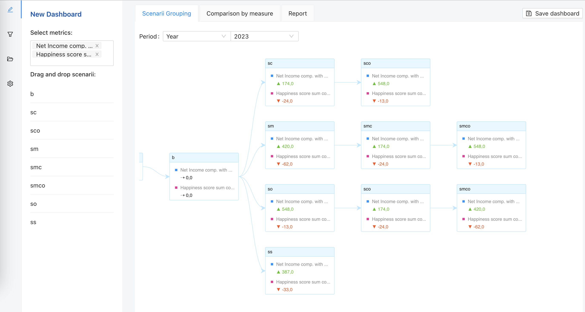
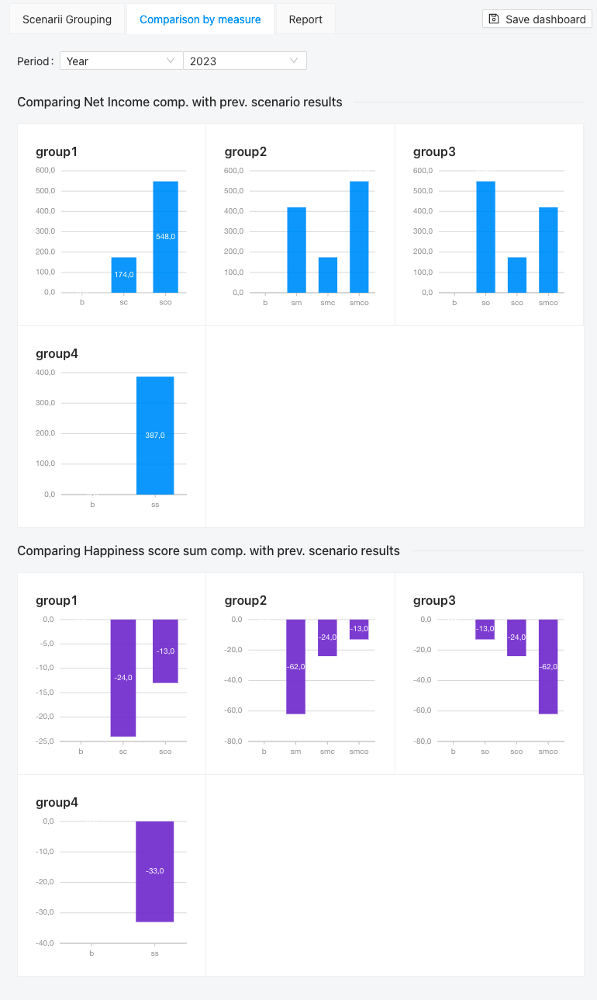

# Context

This is a web app for combining and comparing scenarios, based on [SquashQL](https://github.com/squashql/squashql).
The goal is to provide a user-friendly UI to create scenarios and compare them through different indicators, to make the right decision. 
These indicators can be compared in different types of visualizations: tree graph, reporting table and PDF export.

Start by choosing a year in the drop-down list and select one or several measures. Then, drag and drop the scenarios you 
want to compare:


Here's an overview of what can be achieved.

<p style="text-align: center;">
  
</p>

<p style="text-align: center;">
  
</p>

# Getting Started

### Prerequisites

To run this project you'll need:

- [yarn](https://classic.yarnpkg.com/en/docs/install#windows-stable)
- [SquashQL](https://github.com/squashql/squashql)

### Installation

This project was bootstrapped with [Create React App](https://github.com/facebook/create-react-app).
In the project directory, you can run:

- `yarn install` to install the project dependencies.
- `yarn start` to run the app in the development mode. Then open [http://localhost:3000](http://localhost:3000) to view it in your browser.
- `yarn build` to build the app for production to the `build` folder. See the section about [deployment](https://facebook.github.io/create-react-app/docs/deployment) for more information.

### Configuration

#### Constants

Go to [config/constants.ts](./src/config/constants.ts) to define:

- `ROOT_URL`: SquashQL server URL
- `SCENARII_TABLE`: table name where the scenarii are.
- `SCENARIO_COLUMN`: column name of the scenarii in this table.
- `PERIODS`: array of periods columns (if the project has time related data)

#### Measures implementation

Go to `config/measures/` to define measures using `@squashql/squashql-js` library from [SquashQL](https://github.com/squashql/squashql).

Create one file per table, to declare the related measures in this folder.
Then, export all measures of each table.

Example:

1. Declare measures in `config/measures/budgetMeasures.ts`. Put in "comparisonMeasures", the measures with scenario 
comparison to make them appear nicely as delta in the scenario grouping UI.

2. Create another file of measures if needed, for example `config/measures/otherTableMeasures.ts`.

3. Then, export all measures of each table from `config/measures/index.ts`.

```
export * from "./scenariiTableMeasures";
export * from "./budgetMeasures";
```

#### Filters

Go to `config/filters.ts` to define filters.
Set the alias to display in the UI and choose the list order. For example:

```
export const filters: Filter[] = [
  { id: CATEGORY_COLUMN, alias: "Category" },
  { id: SUBCATEGORY_COLUMN, alias: "Sub-category" },
]
```
